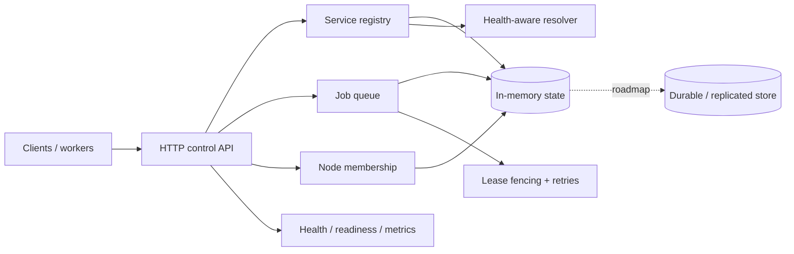

# AtlasMesh architecture

## Design objective

AtlasMesh separates **coordination semantics** from **storage implementation**. v0.1 keeps state in memory so the project can prove lease, retry, health and resolution invariants with deterministic tests before replication is introduced.

## System view

## Engineering invariants

| Concern | AtlasMesh behavior |
| --- | --- |
| Service liveness | Registrations have bounded TTLs; expired instances are excluded before reads and mutations. |
| Healthy resolution | Only live + healthy instances are eligible for weighted deterministic selection. |
| Job ownership | One active lease owner exists per job inside a queue instance. |
| Fencing | Every acquisition advances ownership state; stale workers cannot heartbeat, complete or fail a job after lease loss. |
| Retry semantics | Lease expiry/reported failure returns work for another attempt until the configured limit, then dead-letters it. |
| Delivery contract | Jobs are at-least-once; callers must make external side effects idempotent. |
| Membership | Node liveness is heartbeat/lease based and observational, not consensus-backed. |
| Input safety | HTTP request bodies, TTLs, retry counts, lease durations and job payload/result sizes are bounded. |
| Observability | Structured logs and Prometheus metrics expose control-plane behavior without logging job payloads/results by default. |
| Failure isolation | HTTP timeouts, graceful shutdown and explicit readiness keep server lifecycle behavior observable. |
| Verification | Go 1.26/1.27 CI, race-detector tests, `go vet`, `govulncheck`, CodeQL and SonarQube Cloud. |
| Supply chain | Third-party Actions used by CI, CodeQL and release workflows are pinned to reviewed immutable commits. |

## Core invariants

### Service registry

1. A service instance is addressable by `(service, instance_id)`.
2. Registration has a bounded TTL.
3. Expired instances are removed before reads or mutations.
4. Resolution considers only live and healthy instances.
5. Weight changes selection frequency, never health eligibility.

### Job ownership

1. A job has one active lease owner at a time inside a queue instance.
2. Every acquisition increments `attempt`.
3. Lease expiry makes the previous owner stale immediately.
4. A stale owner cannot heartbeat, complete or fail the job.
5. Expiry on the final allowed attempt dead-letters the job.
6. At-least-once delivery means handlers must make external side effects idempotent.

### Cluster membership

Node membership is lease-based. Heartbeats extend liveness; missing heartbeats remove a member from the live view. Membership in v0.1 is observational rather than consensus-backed.

## Failure semantics

| Failure | v0.1 behavior |
|---|---|
| Service stops heartbeating | Service lease expires and resolver excludes it |
| Worker dies after claim | Lease expires; work becomes claimable if attempts remain |
| Old worker returns late | Fencing rejects completion with `ErrLeaseLost` |
| Final worker lease expires | Job moves to dead-letter state |
| Process restarts | In-memory state is lost; durable state is a planned milestone |

## Trust boundary

AtlasMesh exposes a real HTTP control API, so request parsing and bounded input validation are inside the current runtime boundary. The service does not yet claim a production identity plane: v0.1 has no built-in client authentication, authorization, mTLS, tenant isolation, or durable replicated state.

That distinction matters. Lease fencing and at-least-once job semantics are coordination properties inside one running process; they are not evidence of cross-node consensus or durable ownership after a process restart.

A future network-facing production milestone must define authentication/authorization, transport security, durable coordination state, replay behavior, and operator access policy explicitly.

## Planned persistence boundary

The registry, membership and queue APIs intentionally expose behavior that can later be backed by PostgreSQL, etcd or a consensus log. The storage milestone must preserve atomic claim/fencing semantics rather than merely serialize Go maps to disk.

Moving to replicated storage will also require deciding which semantics are local leases versus globally serialized decisions. That work is intentionally not hidden behind the current word “cluster”.

## Observability

The HTTP layer emits structured request logs and Prometheus counters. Payload bodies, job results, credentials and arbitrary metadata are not emitted into operational metrics by default.

## Explicit non-claims

AtlasMesh v0.1 does not claim:

- consensus, quorum replication or leader election;
- durable state across process restart;
- exactly-once work execution;
- authenticated/authorized control-plane access;
- service-mesh data-plane proxying;
- globally consistent membership;
- production-ready multi-node orchestration.

The project is deliberately a tested control-plane foundation whose next storage/security milestones have stronger requirements than the in-memory v0.1 implementation.
